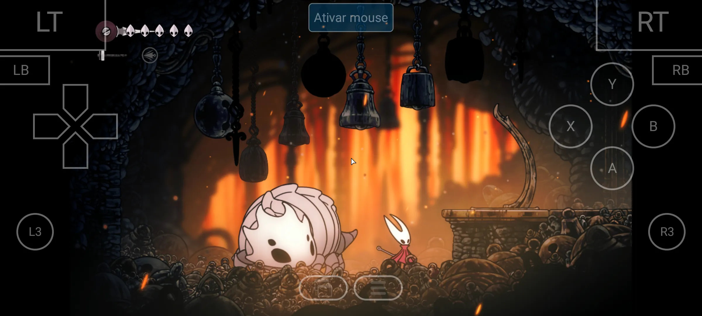
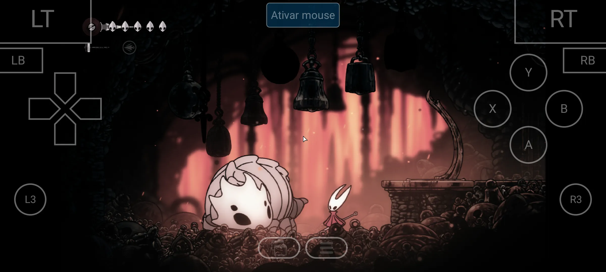
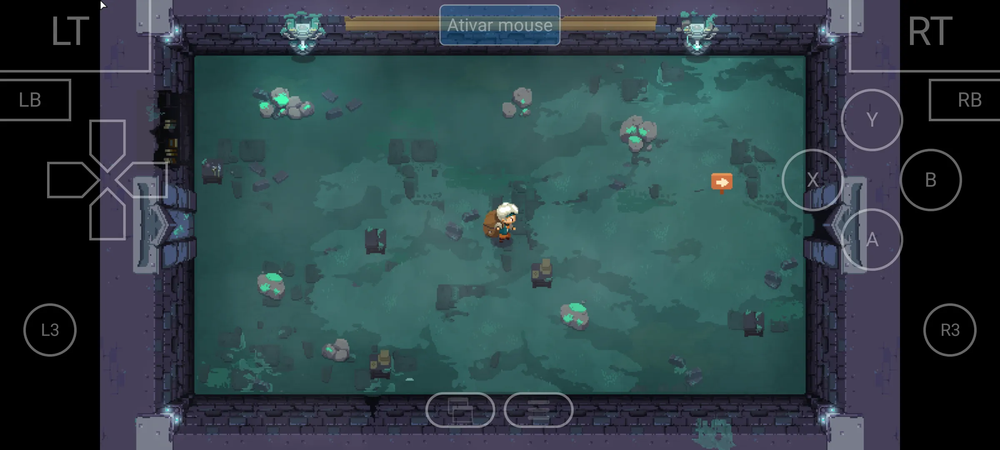
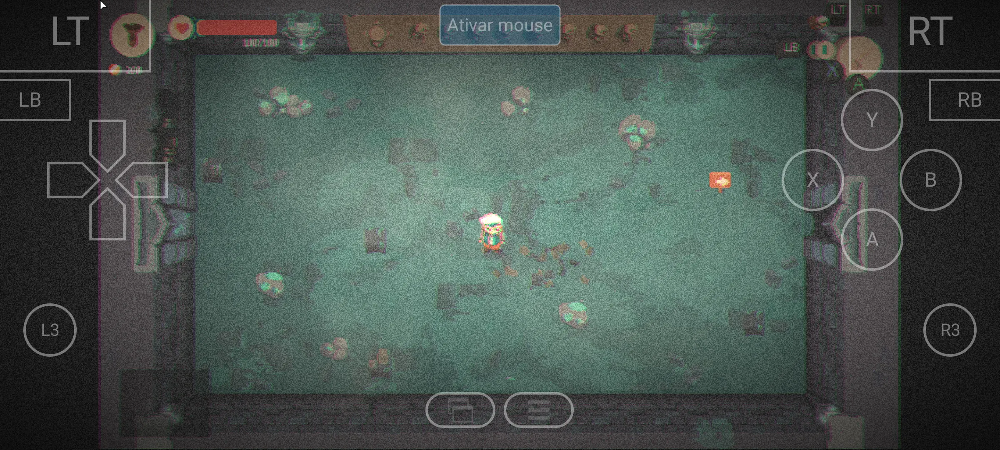
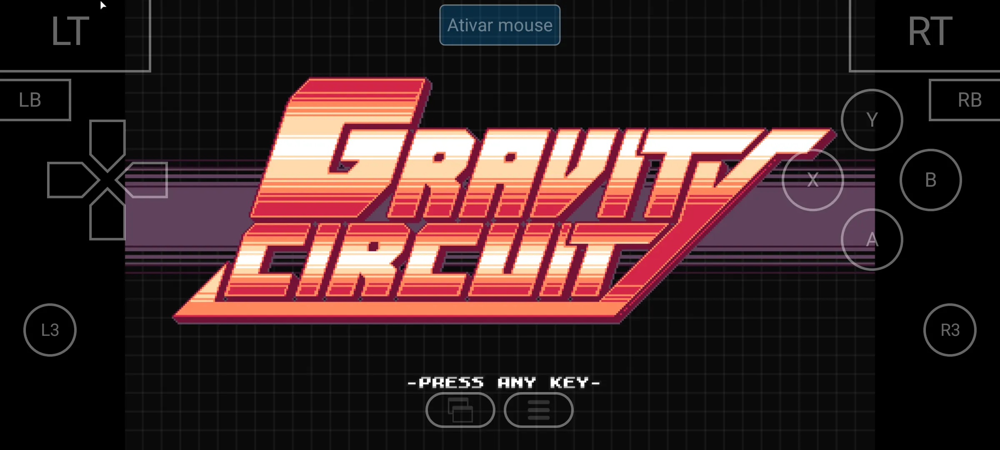
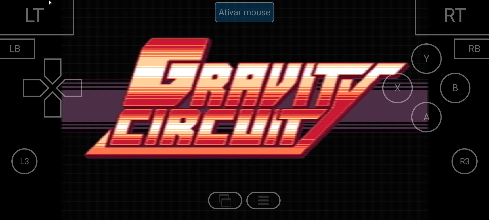

# GameNative Plus

**A personal fork of GameNative with native RetroArch shader support (librashader) — every game frame runs through a filter chain before it hits the screen, and each game remembers its own shader.**

> ## ⚠️ Bleeding edge — use at your own risk
>
> This fork is a **personal hobby project**, largely built with AI-assisted ("vibe") coding to scratch specific needs that I decided to share with the community. It is **not affiliated with** the original [GameNative](https://github.com/utkarshdalal/GameNative) developers or the [Winlator](https://github.com/brunodev85/winlator) project. Expect rough edges, experimental changes and no guarantees — **you use this at your own risk**. Don't expect support from upstream channels; report issues on this repository instead.

---

## Before / After

Real captures from the fork's shader pipeline on an Adreno 650 device (Xiaomi Mi 11). The same game, same frame, with and without a RetroArch shader preset applied — no restart needed to switch.

### Hollow Knight: Silksong

| Without shader | With shader |
|---|---|
|  |  |

### Moonlighter

| Without shader | With shader |
|---|---|
|  |  |

### Gravity Circuit

| Without shader | With shader |
|---|---|
|  |  |

---

## What this fork adds: RetroArch shader support (librashader)

This fork brings **native RetroArch shader support** to GameNative's Vulkan renderer: every game frame is pushed through a [librashader](https://github.com/SnowflakePowered/librashader) filter chain before it hits the screen, so you can apply the same CRT, LCD, scanline, upscaling and color-grading effects you know from RetroArch to your PC games — switched live from the in-game effects panel, with no restart required.

**What's included:**

- [librashader](https://github.com/SnowflakePowered/librashader) Vulkan runtime (built from source in the Gradle build — no prebuilts)
- **The full [libretro/slang-shaders](https://github.com/libretro/slang-shaders) catalog, downloaded shader-by-shader on demand** — 2,541 presets across 35 families (CRT, LCD, cel, HDR, NTSC, color grading…). The APK ships no shader files, only a metadata manifest (`catalog.json`), so the whole catalog is browsable instantly and offline. **Nothing is downloaded by default**: picking a preset downloads only that shader's files (typically a few KB) from the pinned upstream commit, caches them for reuse, and applies the shader automatically
- **Per-game shader memory** — each game remembers its own shader preset (stored per container), so you can keep a CRT look on one game and an LCD/upscaling look on another; switching games never disturbs the other's selection
- Live preset switching (in-game effects panel or per-container config), verified on Adreno 650 with an automated black-box test loop
- A hardened pipeline: chain access from the render thread only, failure fallback (a broken preset degrades to the unshaded frame instead of a black screen), create-first preset swap and bounded fence waits

### How it was built — credit where credit is due

Shipping this feature meant studying how established emulators integrate librashader in Vulkan. An **automated agent** reviewed the production implementations of two reference projects and ported their battle-tested patterns into GameNative's compositor:

- **[melonDS](https://github.com/melonDS-emu/melonDS)** — the DS/DSi emulator by [StapleButter](https://github.com/StapleButter) and contributors — together with the **[melonDS Android port](https://github.com/rafaelvcaetano/melonDS-android)** by Rafael Caetano (v0.7.0.rc2), contributed the offscreen → sampler → swapchain present topology, the image-layout tracking and the wide memory barriers that keep the Adreno driver honest.
- **[ARMSX2](https://github.com/ARMSX2/ARMSX2)** — the native-ARM64 fork of [PCSX2](https://pcsx2.net) — contributed the render-thread parameter application pattern, the chain failure fallback + latch, and the create-first swap that keeps the previous shader alive when a new preset fails to build.

To the melonDS developers, Rafael Caetano, the PCSX2 team, the **ARMSX2 team**, [SnowflakePowered](https://github.com/SnowflakePowered) for librashader, and the [libretro](https://www.libretro.com) community for the shader pack — **thank you**. This feature would not exist without your work.

## What you get

- Play games you actually own on Steam, Epic, GOG and Amazon
- Cloud saves that carry over between your PC and your phone
- Controller and touch support, with a custom control editor and on-screen HUD
- Steam DLC, workshop and branch support
- RetroArch shaders (see above) — the whole 2,541-preset catalog, per-game memory, live switching

## Building

This fork publishes **no releases** — build it yourself. It's a Winlator/GameNative-derived Android project with a Rust toolchain in the loop for librashader.

1. **Prerequisites:**
   - Android SDK (point `local.properties` at it: `sdk.dir=/path/to/Android/Sdk`)
   - JDK 17+ (in this repo's CI/dev setup: `JAVA_HOME=<android-studio>/jbr`)
   - **Rust/cargo** (`~/.cargo/bin`) — librashader is compiled from source for 3 ABIs
   - **NDK 27.3.13750724**
   - Git submodules: `git submodule update --init` (pulls `app/src/main/cpp/extras/adrenotools` and `app/src/main/cpp/lsfg-vk-android`)
2. Build: `JAVA_HOME=<android-studio>/jbr ./gradlew assembleModernDebug` (flavors: `modern` / `legacy`)
3. Install the APK on your Android device, log in to your Steam account, install your game and hit play.

## License

[GPL 3.0](https://github.com/utkarshdalal/GameNative/blob/master/LICENSE) — same as upstream. See [THIRD_PARTY_NOTICES](THIRD_PARTY_NOTICES) for attributions, copyleft source offers, and notices about third-party and proprietary components bundled with the app.

---

**Disclaimer:** This software is meant for playing games that you legally own. Don't use it for piracy or anything else illegal. The maintainer takes no responsibility for misuse.
